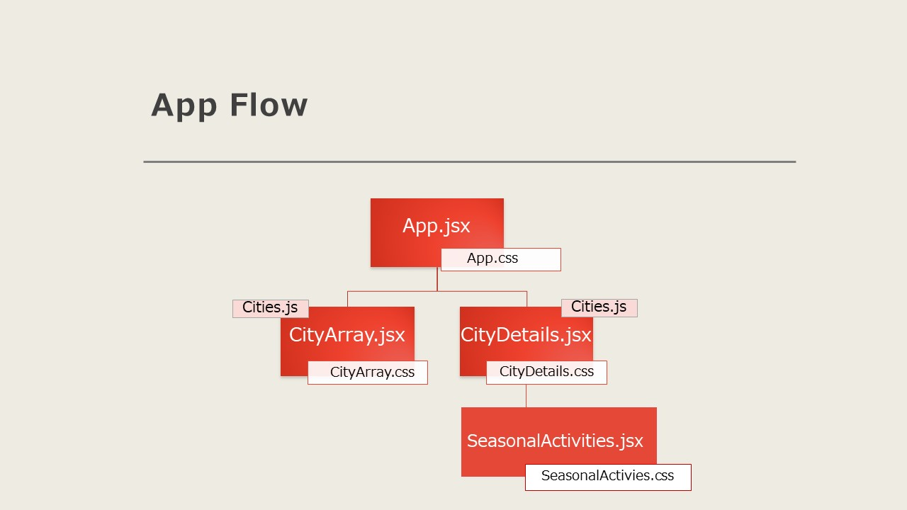

## Setup

Run `npm install` to install packages.
Run `npm run dev` to run the development server.

## App Flow
The app consists of 4 components.
    1. App.jsx is the parent component.
    2. CityDetails.jsx and CityArray.jsx are child components.
    3. SeasonalActivities.jsx is the third component which connects to CityDetails.jsx.

All of these files are taking their information from a JS file which has an array of objects:  Cities.JS.
You can see the flow diagram in the attached image below: 

